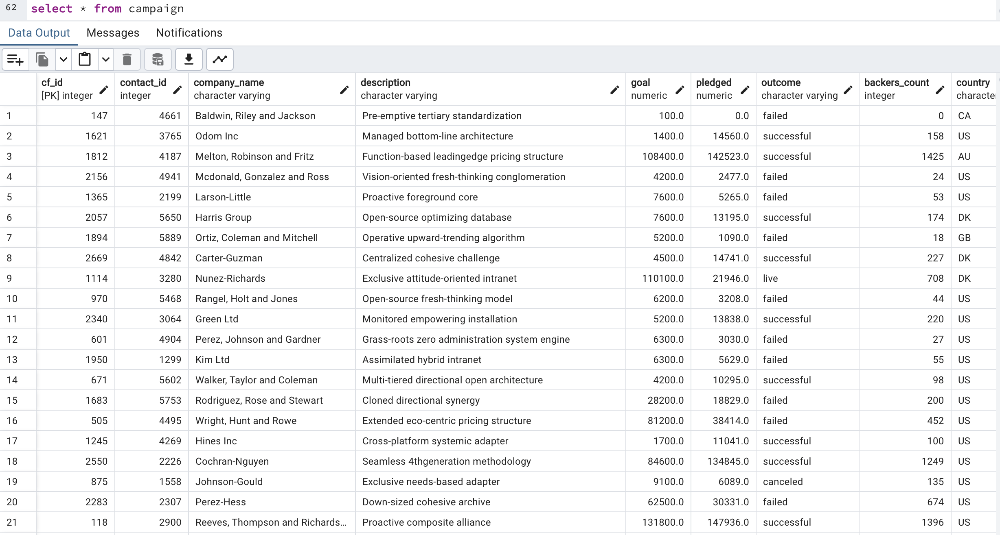
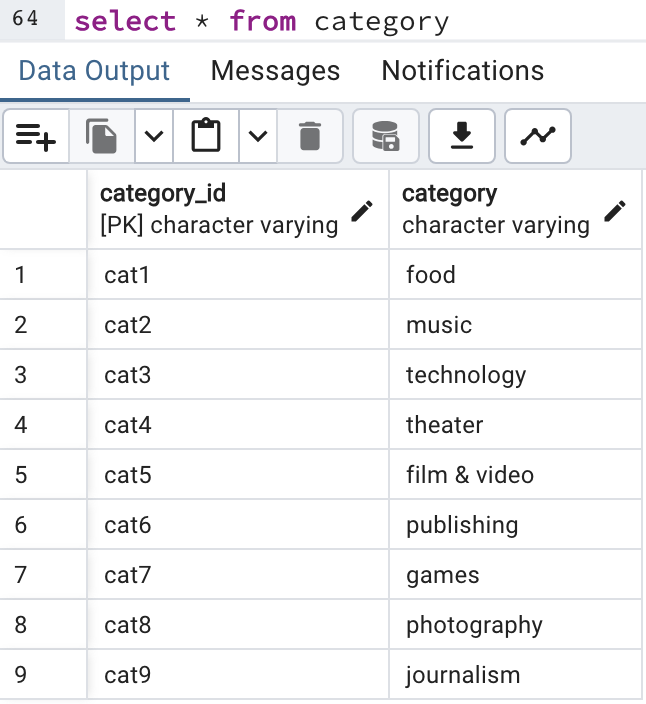
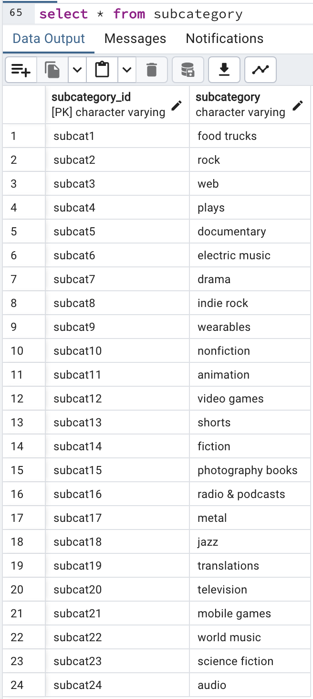
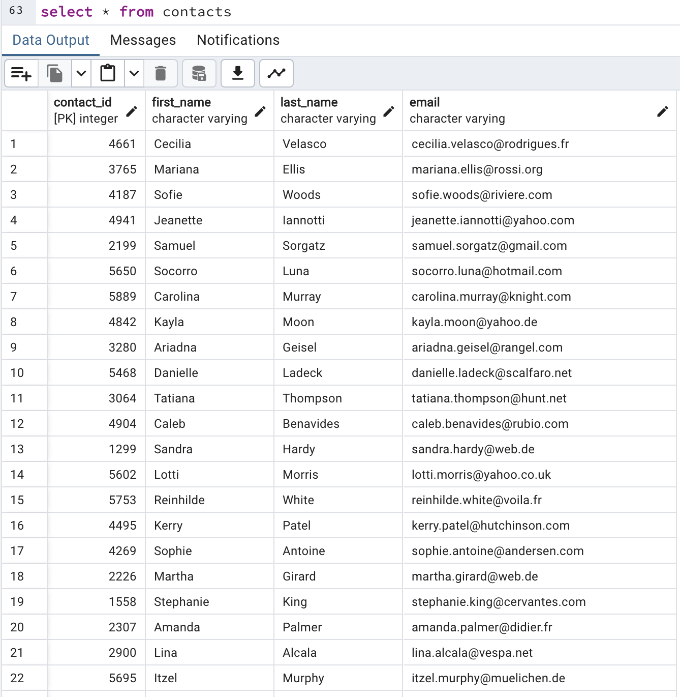
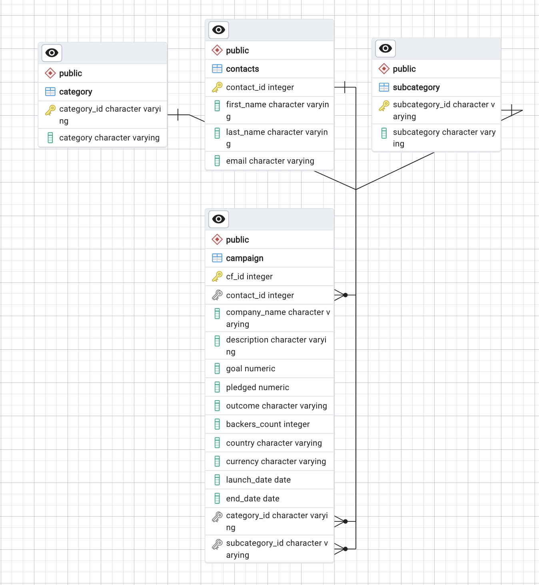

# Project2
**Extract, transform, and load (ETL) mini project**

## Overview
This Jupyter Notebook, ETL_Mini_Project_Starter_Code.ipynb in the *Project_2_Starter_Files* folder, provides a breakdown of how to extract data from datasets, transform that data using Python and Pandas, and then load the transformed data into a SQL database.

## Introduction
The datasets for this project include contacts and crowdfunding data. Our objective was to transform and clean the data so that it is suitable to load into a SQL database.

## Data Extraction and Transformation
The first step in preparing the data for loading was creating the Category and Subcategory DataFrames in Python. In the original Excel crowdfunding dataset (*crowdfunding.xlsx*), this information was compiled together into a single column called "category & sub-category." In order to create DataFrames for the categories and subcategories respectively, we needed to split the column into 2 new columns, "category" and "subcategory." In preparation of making the database, we also made ID columns, "category_id" and "subcategory_id," for each and assigned each category and subcategory a corresponding ID. We then exported each DataFrame as a CSV file (*category.csv* and *subcategory.csv*)for easy loading into SQL.

Next, we had to create a Campaign DataFrame from the Excel crowdfunding dataset. The cleaning process for this step included renaming columns, converting columns representing monetary values from integers to floats, converting crowdfunding launch and end dates from integers to datatime, and eliminating superfluous columns. We then exported the DataFrame as a CSV file (*campaign.csv*) for easy loading into SQL.

The final step in transforming the data was creating a Contacts DataFrame from the Excel contacts dataset (*contacts.xlsx*). We opted to clean the data using Python dictionary methods instead of regular expressions. For optimal extraction, we used json.loads() and list comprehension to turn the contacts dataset into a dictionary with "contact_id," "name," and "email" keys, and created a DataFrame from the dictionary. In anticipation of loading the data into SQL, we split the name column into first and last name columns, and subsequently dropped the original name column. Lastly, before exporting the DataFrame as a CSV file (*contacts.csv*), we re-ordered the columns so the order is "contact_id," "first_name," "last_name," and "email."

## Data Loading
Now that we have extracted and transformed the data, we can load all the CSV files into a SQL database (into their corresponding tables). To get an idea of how each DataFrame would relate to each other, we used http://www.quickdatabasediagrams.com/ to sketch the ERD for the database (*crowdfunding_db_schema.sql*). 

**Our actual database can be found in the *Resources* Folder as *crowdfunding_db.sql*.**

We identified the primary and foreign keys for each table as follows:
- **Campaign**   
    - Primary Key: *cf_id*
    - Foreign Keys: *category_id*, *subcategory_id*, *contact_id*
- **Category**
    - Primary Key: *category_id*
- **Subcategory**
    - Primary Key: *subcategory_id*
- **Contacts**
    - Primary Key: *contact_id*

Final SQL tables:

Campaign Table: 

 

Category Table:

 

Subcategory Table:

 

Contacts Table:

 

Final ERD:

 

## References
Data for this dataset was generated by edX Boot Camps LLC, and is intended for educational purposes only.

## Credits
Michelle Minkowitz and Max Popper
